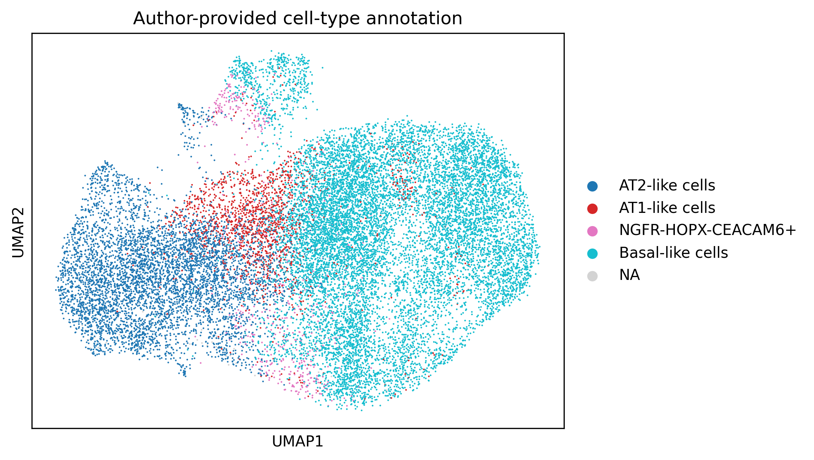
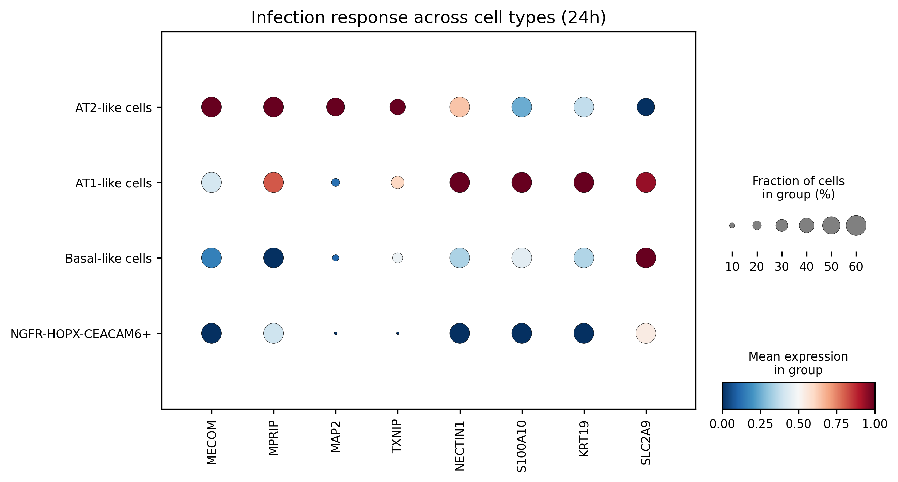
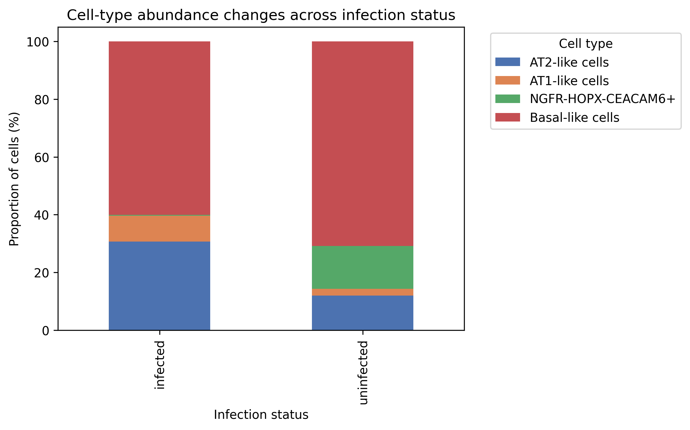
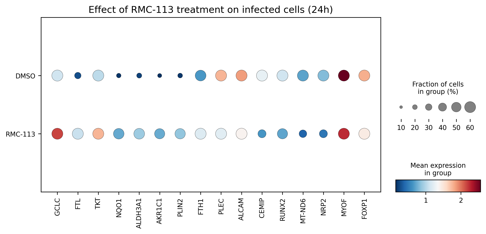

# 🧬 Scanpy Re-analysis of SARS-CoV-2 viscRNA-seq Dataset (GSE272840)


This repository presents an **independent re-analysis of single-cell RNA-seq data** from:

**Karim et al., Nature Communications (2025)**  

The analysis investigates:

- 🦠 SARS-CoV-2 infection response  
- 🧫 epithelial cell-type structure  
- 💊 transcriptional effects of RMC-113 treatment  

---

## 📌 Overview

This project reproduces and extends a **viscRNA-seq dataset analysis** using Scanpy.

The workflow includes:

- quality control and filtering  
- normalization and highly variable gene selection  
- PCA, UMAP, and clustering  
- cell-type annotation  
- infection-response analysis  
- drug-effect analysis  

---

## 🔬 Main Findings

### 🧭 1. Cell-type annotation

Distinct epithelial populations were identified and visualized using UMAP.

[](figures/Figure_07_umap_celltypes.png)

✔ Clear separation of:
- AT2-like cells  
- AT1-like cells  
- Basal-like cells  
- NGFR-HOPX-CEACAM6+ cells  

---

### 🦠 2. Infection response across cell types (24h)

Infection induces **cell-type-specific transcriptional responses**.

[](figures/Figure_11_section_06_celltype_response_24h.png)

✔ Key observations:
- Strong activation in AT1-like cells  
- Distinct regulatory patterns in AT2-like cells  
- Differential response across epithelial populations  

---

### 📊 3. Cell-type abundance changes

Infection alters epithelial population composition.

[](figures/Figure_12_section_07_celltype_abundance.png)

✔ Key observations:
- Increase in basal-like cells  
- Decrease in AT2-like cells  
- Evidence of epithelial remodeling  

---

### 💊 4. Drug effect during infection (RMC-113)

RMC-113 treatment modulates infection-associated transcriptional programs.

[](figures/Figure_13_section_08_drug_effect_24h.png)

✔ Key observations:
- Altered expression of infection-response genes  
- Partial normalization of transcriptional signatures  
- Evidence of therapeutic modulation  

---

## 🧪 Analysis Workflow

1. Load and inspect dataset  
2. Assess QC metrics  
3. Filter low-quality cells  
4. Normalize and log-transform counts  
5. Select highly variable genes  
6. Perform PCA  
7. Compute neighbors, UMAP, and Leiden clusters  
8. Identify marker genes  
9. Annotate cell types  
10. Analyze infection and treatment responses  

---

## 📁 Project Structure

```
scanpy-covid-scRNAseq-reanalysis/
├── notebooks/
│   └── data_full_analysis.ipynb
│
├── data/
│   └── GSE272840_ALO_viscRNAseq.h5ad
│
├── figures/
│   ├── Figure_04_pca_variance.png
│   ├── Figure_07_umap_celltypes.png
│   ├── Figure_11_section_06_celltype_response_24h.png
│   ├── Figure_12_section_07_celltype_abundance.png
│   └── Figure_13_section_08_drug_effect_24h.png
│
├── README.md
└── requirements.txt
```

---

## 🧪 Analysis Workflow

- 🔍 Data loading and inspection  
- 🧫 Experimental condition analysis  
- 📊 Quality control and filtering  
- ⚙️ Normalization and log transformation  
- 🔬 Highly variable gene selection  
- 📏 Scaling and PCA  
- 🧭 Clustering (Leiden) and UMAP  
- 🧬 Marker gene analysis  
- 🏷 Cell-type annotation  
- 🦠 Infection response analysis  
- 💊 Drug effect analysis  

---

## 📊 Dataset

- **GEO accession:** GSE272840  

🔗 https://www.ncbi.nlm.nih.gov/geo/query/acc.cgi?acc=GSE272840  

📌 See `data/README.md` for download instructions.

---

## 🧰 Requirements

Install dependencies:

```bash
pip install -r requirements.txt
```

---

## 🚀 Key Takeaways

- ✅ Clear identification of epithelial cell types  
- 🦠 Strong infection response  
- 🔄 Dynamic population changes  
- 💊 Drug-modulated transcriptional effects  

---

## 👨‍💻 Author

Ahmed Salem  

Independent computational re-analysis using Python and Scanpy  

---

## 📄 Related Publication

**Karim et al., Nature Communications (2025)**  

🔗 [Single-cell viscRNA-seq analysis of SARS-CoV-2 infection in alveolar organoids](https://www.ncbi.nlm.nih.gov/geo/query/acc.cgi?acc=GSE272840)

---

## ⭐ If you find this useful

Give the repo a ⭐
